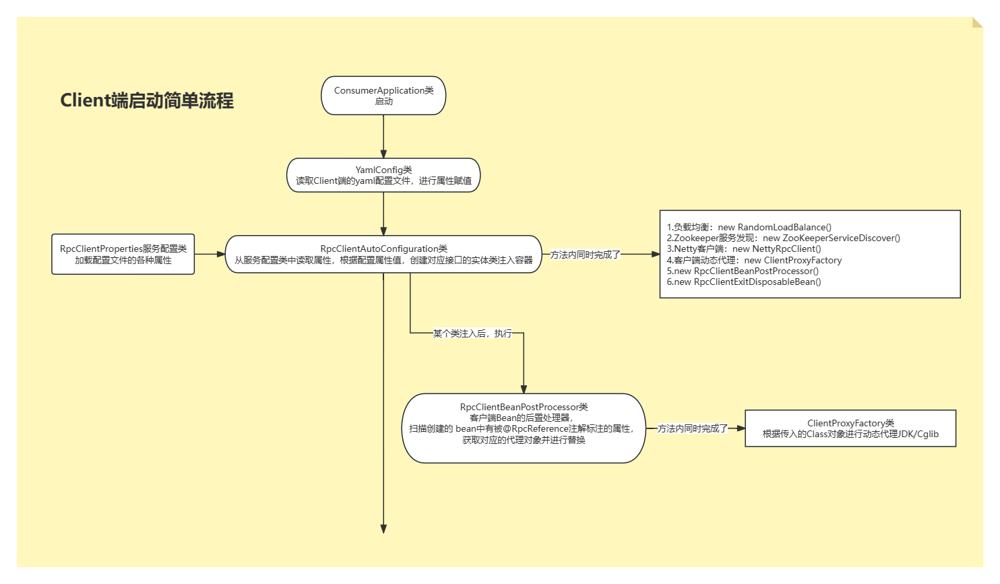
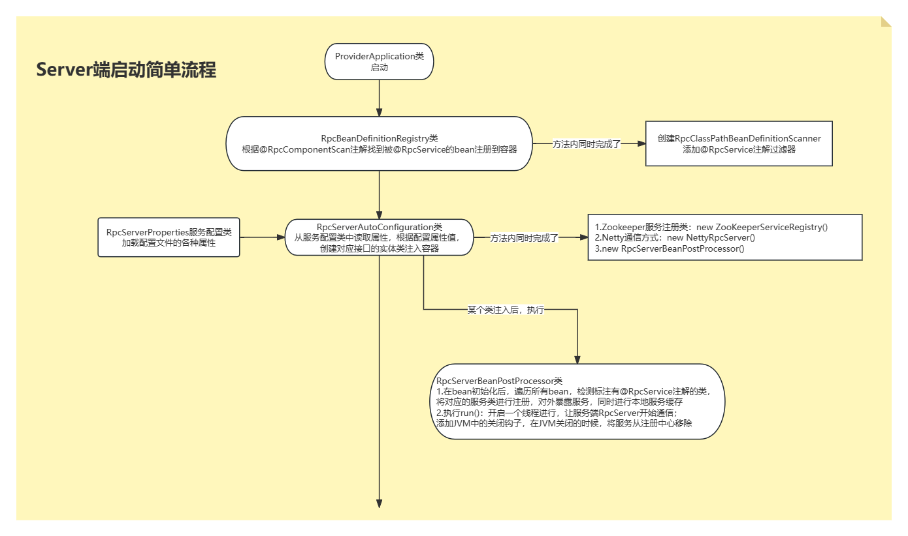
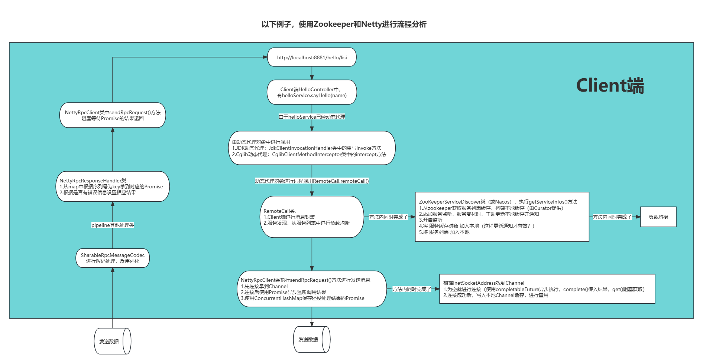
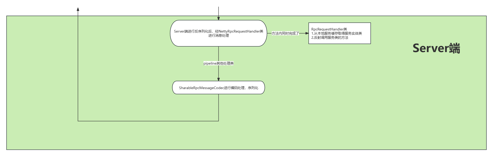

# 5.consumer和provider

## 1.consumer

**作用：调用接口**

### 1.config包

YamlConfig类

```java
package com.mirrors.consumer.config;

import org.springframework.beans.factory.config.YamlPropertiesFactoryBean;
import org.springframework.context.annotation.ComponentScan;
import org.springframework.context.annotation.Configuration;
import org.springframework.context.annotation.PropertySource;
import org.springframework.core.env.PropertiesPropertySource;
import org.springframework.core.io.support.EncodedResource;
import org.springframework.core.io.support.PropertySourceFactory;

import java.io.FileNotFoundException;
import java.io.IOException;
import java.util.Objects;
import java.util.Properties;

/**
 * @author mirrors
 * @version 1.0
 * @date 2023/12/17 10:14
 */
@Configuration
@ComponentScan("com.mirrors")
@PropertySource(value = "classpath:application.yml", factory = YamlConfig.YamlPropertySourceFactory.class)
public class YamlConfig {

    /**
     * 读取 yaml 配置文件的属性工厂类
     */
    static class YamlPropertySourceFactory implements PropertySourceFactory {

        /**
         * @param name
         * @param resource
         * @return
         * @throws IOException
         */
        @Override
        public org.springframework.core.env.PropertySource<?> createPropertySource(String name, EncodedResource resource) throws IOException {
            Properties propertiesFromYaml = loadYamlIntoProperties(resource);
            String sourceName = name != null ? name : resource.getResource().getFilename();
            return new PropertiesPropertySource(Objects.requireNonNull(sourceName), propertiesFromYaml);
        }

        /**
         * 将yaml文件转为properties返回
         *
         * @param resource
         * @return
         * @throws FileNotFoundException
         */
        private Properties loadYamlIntoProperties(EncodedResource resource) throws FileNotFoundException {
            try {
                YamlPropertiesFactoryBean factory = new YamlPropertiesFactoryBean();
                factory.setResources(resource.getResource());
                factory.afterPropertiesSet();
                return factory.getObject();
            } catch (IllegalStateException e) {
                Throwable cause = e.getCause();
                if (cause instanceof FileNotFoundException)
                    throw (FileNotFoundException) e.getCause();
                throw e;
            }
        }
    }
}
```

### 2.controller包

HelloController类

```java
package com.mirrors.consumer.controller;

import com.mirrors.api.service.HelloService;
import com.mirrors.client.annotation.RpcReference;
import org.springframework.web.bind.annotation.PathVariable;
import org.springframework.web.bind.annotation.RequestMapping;
import org.springframework.web.bind.annotation.RestController;

import java.util.HashMap;
import java.util.Map;

/**
 * @author mirrors
 * @version 1.0
 * @date 2023/12/16 20:54
 */
@RestController
@RequestMapping
public class HelloController {

    @RpcReference // 代理
    private HelloService helloService;

    @RequestMapping("/hello/{name}")
    public String hello(@PathVariable("name") String name) {
        return helloService.sayHello(name);
    }

    @RequestMapping("/hello/test/{count}")
    public Map<String, Long> performTest(@PathVariable("count") Long count) {
        Map<String, Long> result = new HashMap<>();
        result.put("调用次数", count);

        long start = System.currentTimeMillis();
        for (long i = 0; i < count; i++) {
            helloService.sayHello(Long.toString(i));
        }
        result.put("耗时", System.currentTimeMillis() - start);

        return result;
    }
}
```

UserController类

```java
package com.mirrors.consumer.controller;

import com.mirrors.api.bean.User;
import com.mirrors.api.service.UserService;
import com.mirrors.client.annotation.RpcReference;
import org.springframework.web.bind.annotation.RequestMapping;
import org.springframework.web.bind.annotation.RestController;

import java.util.List;

/**
 * @author mirrors
 * @version 1.0
 * @date 2023/12/16 20:50
 */
@RestController
public class UserController {

    @RpcReference // 代理
    private UserService userService;

    @RequestMapping("/user/getUser")
    public User getUser() {
        return userService.queryUser();
    }

    @RequestMapping("/user/getAllUser")
    public List<User> getAllUser() {
        return userService.getAllUsers();
    }
}
```

## 2.provider

**作用：实现接口**

### 1.service包

HelloServiceImpl类

```java
package com.mirrors.provider.service.impl;

import com.mirrors.api.service.HelloService;
import com.mirrors.server.annotation.RpcService;

/**
 * @author mirrors
 * @version 1.0
 * @date 2023/12/16 20:40
 */
@RpcService(interfaceClass = HelloService.class)
public class HelloServiceImpl implements HelloService {
    @Override
    public String sayHello(String name) {
        return "Hello, " + name;
    }
}
```

UserServiceImpl类

```java
package com.mirrors.provider.service.impl;

import com.mirrors.api.bean.User;
import com.mirrors.api.service.UserService;
import com.mirrors.server.annotation.RpcService;

import java.util.ArrayList;
import java.util.Arrays;
import java.util.List;

/**
 * @author mirrors
 * @version 1.0
 * @date 2023/12/16 20:37
 */
@RpcService(interfaceClass = UserService.class)
public class UserServiceImpl implements UserService {
    @Override
    public User queryUser() {
        return new User("mirrors", "20231216", 23);
    }

    @Override
    public List<User> getAllUsers() {
        return new ArrayList<>(
                Arrays.asList(
                        new User("mirrors1", "20231216", 23),
                        new User("mirrors2", "20231216", 23),
                        new User("mirrors3", "20231216", 23)
                )
        );
    }
}
```

## 3.provider-api

**作用：暴露接口**

### 1.bean包

User类

```java
package com.mirrors.api.bean;

import lombok.AllArgsConstructor;
import lombok.Data;
import lombok.NoArgsConstructor;

import java.io.Serializable;

/**
 * @author mirrors
 * @version 1.0
 * @date 2023/12/16 20:15
 */
@Data
@AllArgsConstructor
@NoArgsConstructor
public class User implements Serializable {

    /**
     * 用户名
     */
    private String username;

    /**
     * 密码
     */
    private String password;

    /**
     * 年龄
     */
    private Integer age;
}
```

###2.service包

HelloService类

```java
package com.mirrors.api.service;

/**
 * @author mirrors
 * @version 1.0
 * @date 2023/12/16 20:27
 */
public interface HelloService {

    String sayHello(String name);
}
```

UserService类

```java
package com.mirrors.api.service;

import com.mirrors.api.bean.User;

import java.util.List;

/**
 * @author mirrors
 * @version 1.0
 * @date 2023/12/16 20:27
 */
public interface UserService {

    User queryUser();

    List<User> getAllUsers();
}
```

# 6.项目主要实现

## 1.自定义消息协议，编解码

既然 RPC 是远程调用，必然离不开网络通信协议。客户端在向服务端发起调用之前，需要考虑采用何种方式将调用信息进行编码，并传输到服务端。因为 **RPC 框架对性能有非常高的要求，所以通信协议应该越简单越好，这样可以减少编解码的性能损耗**。RPC 框架可以基于不同的协议实现，**大部分主流 RPC 框架会选择 TCP、HTTP 协议，出名的 gRPC 框架使用的则是 HTTP2。TCP、HTTP、HTTP2 都是稳定可靠的，但其实使用 UDP 协议也是可以的，具体看业务使用的场景**。成熟的 RPC 框架能够支持多种协议，例如阿里开源的 Dubbo 框架被很多互联网公司广泛使用，其中可插拔的协议支持是 Dubbo 的一大特色，这样不仅可以给开发者提供多种不同的选择，而且为接入异构系统提供了便利。

### 1.自定义消息协议

自定义协议的要数：

- **魔数**，用来在第一时间判定是否是无效数据包
- **版本号**，可以支持协议的升级
- **序列化算法**，消息正文到底采用哪种序列化反序列化方式，可以由此扩展，例如：json、protobuf、hessian、jdk、kryo
- **消息类型**，是登录、注册、单聊、群聊... 跟业务相关
- **状态类型**
- **请求序号**，为了双工通信，提供异步能力，通过这个请求ID将响应关联起来，也可以通过请求ID做链路追踪。
- **正文长度**，标注传输数据内容的长度，用于判断是否是一个完整的数据包
- 消息正文，主要传递的消息内容

> 魔数的作用：**快速** 识别[字节流](https://so.csdn.net/so/search?q=字节流&spm=1001.2101.3001.7020)是否是程序能够处理的，能处理才进行后面的 **耗时** 业务操作，如果不能处理，尽快执行失败，断开连接等操作。

本项目设计的消息协议如下：

```
------------------------------------------------------------------------------------------
| 魔数 (4byte) | 版本号 (1byte)  | 序列化算法 (1byte) | 消息类型 (1byte) | 状态类型 (1byte)   |
-------------------------------------------------------------------------------------------
|            消息序列号 (4byte)               |            消息长度 (4byte)                 |
-------------------------------------------------------------------------------------------
|                        消息内容 (不固定)                                                  |
-------------------------------------------------------------------------------------------
```

### 2.编解码

（1）编解码实现

1. 编解码主要实现类为：`com.wxy.rpc.core.codec.SharableRpcMessageCodec.java`
2. 该类继承于 netty 中的 `io.netty.handler.codec.MessageToMessageCodec`，这个类是一个用于动态编/解码消息的编解码器，这可以看作是`MessageToMessageDecoder` 和 `MessageToMessageEncoder` 的组合
3. 这个类中有两个方法，`encode()` 就是将输入的 `RpcMessage` 编码成 `ByteBuf` ，`decode()` 就是将 `ByteBuf` 解码成 `RpcMessage`，编码为出站操作，解码为入站操作。

（2）解决粘包半包

1、现象分析

粘包

- 现象，发送 abc 和 def，接收 abcdef
- 原因
  - **应用层：接收方 ByteBuf 设置太大（Netty 默认 1024）**
  - **滑动窗口：假设发送方 256 bytes 表示一个完整报文，但由于接收方处理不及时且窗口大小足够大，这 256 bytes 字节就会缓冲在接收方的滑动窗口中，当滑动窗口中缓冲了多个报文就会粘包**
  - **Nagle 算法：会造成粘包**

半包

- 现象，发送 abcdef，接收 abc 和 def
- 原因
  - **应用层：接收方 ByteBuf 小于实际发送数据量**
  - **滑动窗口：假设接收方的窗口只剩了 128 bytes，发送方的报文大小是 256 bytes，这时放不下了，只能先发送前 128 bytes，等待 ack 后才能发送剩余部分，这就造成了半包**
  - **MSS 限制：当发送的数据超过 MSS 限制后，会将数据切分发送，就会造成半包**


本质是**因为 TCP 是流式协议，消息无边界**

2、解决方案

- **短连接：发一次数据包建立一次连接，这样连接建立到连接断开之间就是一次消息边界，缺点是效率低；**
- **固定长度：每一条消息采用固定长度，缺点是浪费空间；**
- **分隔符：每一条消息采用分隔符，例如 \n ，缺点是需要转义；**
- **消息长度+消息内容**：每一条消息分为 header 和 body，header 中包含 body 的长度（推荐）；

**本项目采取的是 消息长度 + 消息内容 来解决的半包问题**，主要实现类为 `com.wxy.rpc.core.codec.RpcFrameDecoder` ，这个类继承了 netty 中的 `io.netty.handler.codec.LengthFieldBasedFrameDecoder` 类，这个类是一种解码器，根据消息中长度字段的值动态拆分接收到的ByteBufs。

在发送消息前，**先约定用定长字节表示接下来数据的长度**，所以，按照我们定义的消息协议，只需要**创建一个 `new LengthFiledBasedFrameDecoder(1024, 12, 4, 0)` 的帧解码器就可以解决粘包半包问题了。**

## 2.序列化算法

### 1.概述

客户端和服务端在通信过程中需要传输哪些数据呢？这些数据又该如何编解码呢？如果**采用 TCP 协议，你需要将调用的接口、方法、请求参数、调用属性等信息序列化成二进制字节流传递给服务提供方**，服务端接收到数据后，**再把二进制字节流反序列化得到调用信息，然后利用反射的原理调用对应方法，最后将返回结果、返回码、异常信息等返回给客户端**。

所谓**序列化和反序列化就是将对象转换成二进制流以及将二进制流再转换成对象的过程**。因为**网络通信依赖于字节流**，而且这些请求信息都是不确定的，所以一般会选用通用且高效的序列化算法。比较常用的序列化算法有 FastJson、Kryo、Hessian、Protobuf 等，这些第三方序列化算法都比 Java 原生的序列化操作都更加高效。Dubbo 支持多种序列化算法，并定义了 Serialization 接口规范，所有序列化算法扩展都必须实现该接口，其中**默认使用的是 Hessian 序列化算法**。

序列化对于远程调用的响应速度、吞吐量、网络带宽消耗等同样也起着至关重要的作用，是我们提升分布式系统性能的最关键因素之一。

判断一个编码框架的优劣主要从以下几个方面：

```undefined
1. 是否支持跨语言，支持语种是否丰富
2. 编码后的码流
3. 编解码的性能
4. 类库是否小巧，API使用是否方便
5. 使用者开发的工作量和难度。
```

### 2.实现

本项目实现了五种序列化算法，分别是：

**JDK、JSON、HESSIAN、KRYO 、PROTOSTUFF**，其中JSON使用的是Gson实现，此外还可以使用FastJson、Jackson等实现JSON序列化。

五种序列化算法的比较如下：

| 序列化算法     | **优点**                 | **缺点**         |
| -------------- | ------------------------ | ---------------- |
| **Kryo**       | 速度快，序列化后体积小   | 跨语言支持较复杂 |
| **Hessian**    | 默认支持跨语言           | 较慢             |
| **Protostuff** | 速度快，基于protobuf     | 需静态编译       |
| **Json**       | 使用方便                 | 性能一般         |
| **Jdk**        | 使用方便，可序列化所有类 | 速度慢，占空间   |

## 3.负载均衡算法

本项目实现了 Random、RoundRobin、ConsistentHash 三种负载均衡算法

在**分布式系统中，服务提供者和服务消费者都会有多台节点，如何保证服务提供者所有节点的负载均衡呢**？客户端在发起调用之前，**需要感知有多少服务端节点可用，然后从中选取一个进行调用**。客户端需要拿到服务端节点的状态信息，并根据不同的策略实现负载均衡算法。负载均衡策略是影响 RPC 框架吞吐量很重要的一个因素，下面我们介绍几种最常用的负载均衡策略。

- **Round-Robin 轮询**。Round-Robin 是最简单有效的负载均衡策略，并没有考虑服务端节点的实际负载水平，而是依次轮询服务端节点。
- Weighted Round-Robin 权重轮询。对不同负载水平的服务端节点增加权重系数，这样可以通过权重系数降低性能较差或者配置较低的节点流量。权重系数可以根据服务端负载水平实时进行调整，使集群达到相对均衡的状态。
- **Least Connections 最少连接数**。客户端**根据服务端节点当前的连接数进行负载均衡，客户端会选择连接数最少的一台服务器进行调用**。Least Connections 策略只是服务端其中一种维度，我们可以演化出**最少请求数、CPU 利用率最低等其他维度的负载均衡方案**。
- **【重点】Consistent Hash 一致性 Hash**。目前主流推荐的负载均衡策略，Consistent Hash 是一种特殊的 Hash 算法，**在服务端节点扩容或者下线时，尽可能保证客户端请求还是固定分配到同一台服务器节点**。Consistent Hash 算法是**采用哈希环来实现的**，通过 **Hash 函数将对象和服务器节点放置在哈希环上**，一般来说服务器可以选择 IP + Port 进行 Hash，然后为对象选择对应的服务器节点，**在哈希环中顺时针查找距离对象 Hash 值最近的服务器节点。**
- **Random 随机访问**。

此外，负载均衡算法可以是多种多样的，客户端可以记录例如健康状态、连接数、内存、CPU、Load 等更加丰富的信息，根据综合因素进行更好地决策。

## 4.动态代理

RPC 框架怎么做到像调用本地接口一样调用远端服务呢？这必须依赖动态代理来实现。**需要创建一个代理对象，在代理对象中完成数据报文编码，然后发起调用发送数据给服务提供方，以此屏蔽 RPC 框架的调用细节**。因为代理类是在运行时生成的，所以代理类的生成速度、生成的字节码大小都会影响 RPC 框架整体的性能和资源消耗，所以需要慎重选择动态代理的实现方案。动态代理比较主流的实现方案有以下几种：JDK 动态代理、Cglib、Javassist、ASM、Byte Buddy。

- **JDK 动态代理：**在运行时可以**动态创建**代理类，但是 JDK 动态代理的功能比较局限，代理对象必须实现一个接口，否则抛出异常。因为代理类会继承 Proxy 类，然而 Java 是不支持多重继承的，只能通过接口实现多态。JDK 动态代理所生成的代理类是接口的实现类，不能代理接口中不存在的方法。JDK 动态代理是通过反射调用的形式代理类中的方法，比直接调用肯定是性能要慢的。
- **Cglib 动态代理：**Cglib 是基于 ASM 字节码生成框架实现的，通过字节码技术生成的代理类，所以代理类的类型是不受限制的。而且 Cglib 生成的代理类是继承于被代理类，所以可以提供更加灵活的功能。在代理方法方面，Cglib 是有优势的，它采用了 FastClass 机制，为代理类和被代理类各自创建一个 Class，这个 Class 会为代理类和被代理类的方法分配 index 索引，FastClass 就可以通过 index 直接定位要调用的方法，并直接调用，这是一种空间换时间的优化思路。
- **Javassist 和 ASM：**二者都是 Java 字节码操作框架，使用起来难度较大，需要开发者对 Class 文件结构以及 JVM 都有所了解，但是它们都比反射的性能要高。Byte Buddy 也是一个字节码生成和操作的类库，Byte Buddy 功能强大，相比于 Javassist 和 ASM，Byte Buddy 提供了更加便捷的 API，用于创建和修改 Java 类，无须理解字节码的格式，而且 Byte Buddy 更加轻量，性能更好。

本项目实现了 【JDK动态代理】 和 【CGLIB 动态代理】。

## 5.服务注册与发现

在分布式系统中，不同服务之间应该如何通信呢？**传统的方式可以通过 HTTP 请求调用、保存服务端的服务列表等，这样做需要开发者主动感知到服务端暴露的信息，系统之间耦合严重**。**为了更好地将客户端和服务端解耦，以及实现服务优雅上线和下线，于是注册中心就出现了。**

在 RPC 框架中，主要是**使用注册中心来实现服务注册和发现的功能**。服务端节点**上线后自行向注册中心注册服务列表**，节点**下线时需要从注册中心将节点元数据信息移除**。客户端向服务端发起调用时，自己负责**从注册中心获取服务端的服务列表，然后在通过负载均衡算法选择其中一个服务节点进行调用**。以上是最简单直接的服务端和客户端的发布和订阅模式，不需要再借助任何中间服务器，性能损耗也是最小的。

现在思考一个问题，服务在下线时需要从注册中心移除元数据，那么**注册中心怎么才能感知到服务下线呢**？我们最先想到的方法就是**节点主动通知的实现方式**，当节点需要下线时，向注册中心发送下线请求，让注册中心移除自己的元数据信息。但是**如果节点异常退出，例如断网、进程崩溃等**，那么注册中心将会一直残留异常节点的元数据，从而可能造成服务调用出现问题。

为了避免上述问题，实现服务优雅下线比较好的方式是**采用主动通知 + 心跳检测的方案**。除了主动通知注册中心下线外，还需要增加节点与注册中心的心跳检测功能，这个过程也叫作探活。**心跳检测可以由节点或者注册中心负责，例如注册中心可以向服务节点每 60s 发送一次心跳包，如果 3 次心跳包都没有收到请求结果，可以任务该服务节点已经下线。**

由此可见，采用注册中心的好处是可**以解耦客户端和服务端之间错综复杂的关系，并且能够实现对服务的动态管理**。服务**配置可以支持动态修改，然后将更新后的配置推送到客户端和服务端，无须重启任何服务。**

本项目目前实现了以 Zookeeper 为注册中心，后续考虑引入 Nacos、Redis 等实现服务注册于发现功能。

## 6.RPC调用方式

成熟的 RPC 框架一般会提供四种调用方式，分别为**同步 Sync**、**异步 Future**、**回调 Callback **和 **单向 Oneway**。RPC 框架的性能和吞吐量与合理使用调用方式是息息相关的，下面我们逐一介绍下四种调用方式的实现原理。

- **Sync 同步调用**。客户端线程发起 RPC 调用后，当前线程会一直阻塞，直至服务端返回结果或者处理超时异常。Sync 同步调用一般是 RPC 框架默认的调用方式，为了保证系统可用性，客户端设置**合理的超时时间**是非常重要的。虽说 Sync 是同步调用，但是客户端线程和服务端线程并不是同一个线程，实际在 RPC 框架内部还是异步处理的。Sync 同步调用的过程如下图所示。


- **Future 异步调用**。客户端**发起调用后不会再阻塞等待**，而是**拿到 RPC 框架返回的 Future 对象**，**调用结果会被服务端缓存，客户端自行决定后续何时获取返回结果**。当客户端主动获取结果时，该过程是阻塞等待的。Future 异步调用过程如下图所示。


- **Callback 回调调用**。如下图所示，客户端**发起调用时，将 Callback 对象传递给 RPC 框架**，无须同步等待返回结果，直接返回。**当获取到服务端响应结果或者超时异常后，再执行用户注册的 Callback 回调**。所以 Callback 接口一般包含 onResponse 和 onException 两个方法，分别对应成功返回和异常返回两种情况。


- **Oneway 单向调用**。客户端发起请求之后直接返回，**忽略返回结果**。Oneway 方式是最简单的，具体调用过程如下图所示。


## 7.集成 Spring 自定义注解提供服务注册与消费

- @RpcComponentScan - **扫描被 @RpcService 标注的组件并将对应的 BeanDefiniton 对象注册到Spring**。

- **@RpcService - 该注解用来标注需要暴露的服务实现类，被标注的类将会被注入到 Spring 容器中，同时将对应服务信息注册到远程注册中心；**

- **@RpcReference - 服务注入注解，被标注的属性将自动注入服务的实现类（基于动态代理实现）**

## 8.集成 SpringBoot 完成自动配置

实现 `rpc-client` 和 `rpc-server` 的 `starter` 模块，编写对应的自动配置的配置类以及 `spring.factories` 文件，引入对应的`starter` 即可完成自动配置功能。

## 9.增加 Netty 心跳机制

解决了每次请求客户端都要重新与服务端建立 netty 连接，非常耗时，增加心跳检查机制，**保持长连接，复用 channel 连接；**

- 长连接：避免了每次调用新建TCP连接，提高了调用的响应速度；
- Channel 连接复用：避免重复连接服务端；
- 多路复用：单个TCP连接可交替传输多个请求和响应的消息，降低了连接的等待闲置时间，从而减少了同样并发数下的网络连接数，提高了系统吞吐量。

具体实现代码在

 `com.wxy.rpc.client.transport.netty.NettyRpcClient`，`com.wxy.rpc.client.transport.netty.ChannelProvider` 和   `com.wxy.rpc.server.transport.netty.NettyRpcRequestHandler`三个类中。

## 10.增加 Zookeeper 服务本地缓存并监听

解决了每次请求都需要访问 zk 来进行服务发现，可以添加本地服务缓存功能，然后**监听 zk 服务节点的变化来动态更新本地服务列表。**

服务本地缓存并监听的核心代码如下：

## 11.实现了 SPI 机制

已实现，**参考Dubbo部分源码，实现了自定义的SPI机制**，目前仅支持**根据接口类型加载配置文件中的所有具体的扩展实现类**，并且可以**根据指定的key获取特定的实现类**，具体实现类逻辑在 `com.wxy.rpc.core.extension.ExtensionLoader` 中。

# 7.项目测试

## 1.相关概念

参考：[吞吐量（TPS）、QPS、并发数、响应时间（RT）概念 - KING。。。 - 博客园 (cnblogs.com)](https://www.cnblogs.com/longxiaojiangi/p/9259745.html) 

​	   [性能指标：QPS、TPS、RT、吞吐量 - java宝典 - 博客园 (cnblogs.com)](https://www.cnblogs.com/java-bible/p/14333884.html) 

​	   [如何自测接口的QPS、最大吞吐量_接口吞吐量-CSDN博客](https://blog.csdn.net/kolbjbe/article/details/114208557) 

​	   [如何用Jmeter做接口性能测试 - 知乎 (zhihu.com)](https://zhuanlan.zhihu.com/p/402088248) 

​	   [记一次完整的java项目压力测试 - 星朝 - 博客园 (cnblogs.com)](https://www.cnblogs.com/jpfss/p/11645793.html) 

​	   [jmeter中线程数，Ramp-Up Period，循环次数之间的设置概念 - 简书 (jianshu.com)](https://www.jianshu.com/p/2d75cde3b2c9) 

​	   [QPS常用的测试以及优化方法_qps怎么测-CSDN博客](https://blog.csdn.net/weixin_47872288/article/details/124128592#:~:text=%E6%B5%8B%E8%AF%95QPS%E7%9A%84%E6%96%B9%E6%B3%95%201%20%E5%9C%A8%E6%8E%A5%E5%8F%A3%E4%B8%AD%E4%B9%A6%E5%86%99%E8%AF%B7%E6%B1%82%E6%AC%A1%E6%95%B0%EF%BC%8C%E5%9C%A8%E6%97%A5%E5%BF%97%E4%B8%AD%E7%BB%9F%E8%AE%A1%E8%AF%B7%E6%B1%82%E6%AC%A1%E6%95%B0%E5%8D%B3%E5%8F%AF%20logger.info%202%20%E5%9C%A8tomcat%E6%9C%8D%E5%8A%A1%E5%99%A8%E4%B8%AD%E7%9A%84access%20log%E6%8C%87%E5%AE%9A%E5%B1%9E%E6%80%A7%EF%BC%8C%E9%BB%98%E8%AE%A4%E8%AE%BF%E9%97%AE%E7%9A%84url%E4%BC%9A%E6%9C%89%E7%BB%9F%E8%AE%A1%E5%85%B6%E6%95%B0%E9%87%8F%20%EF%BC%88%E5%9C%A8%E6%97%A5%E5%BF%97%E4%B8%AD%E8%BF%99%E4%B9%88%E6%9F%A5%E8%AF%A2%EF%BC%89,%27%20-f4%7Cuniq%20-c%7Csort%20-n%20-r%20cut%E8%BF%87%E6%BB%A4%E7%A9%BA%E6%A0%BC%EF%BC%8C%E5%8F%96%E7%AC%AC4%E5%88%97%EF%BC%8Cuniq%20-c%20%E5%9C%A8%E6%AF%8F%E5%88%97%E6%97%81%E8%BE%B9%E6%98%BE%E7%A4%BA%E8%AF%A5%E8%A1%8C%E9%87%8D%E5%A4%8D%E5%87%BA%E7%8E%B0%E7%9A%84%E6%AC%A1%E6%95%B0%EF%BC%8Csort%E6%8E%92%E5%BA%8F) 


​	   [Jmeter之性能测试TPS - yinrw - 博客园 (cnblogs.com)](https://www.cnblogs.com/yinrw/p/14144069.html) 

​           [jmeter使用技巧—tps瓶颈点分析-腾讯云开发者社区-腾讯云 (tencent.com)](https://cloud.tencent.com/developer/article/1797370) 

​	   [使用Jmeter查看聚合报告_聚合报告怎么看-CSDN博客](https://blog.csdn.net/weixin_45412176/article/details/106790525#:~:text=%E4%BD%BF%E7%94%A8Jmeter%E6%9F%A5%E7%9C%8B%E8%81%9A%E5%90%88%E6%8A%A5%E5%91%8A%201%20%E6%96%B0%E5%BB%BA%E7%BA%BF%E7%A8%8B%E7%BB%84%EF%BC%8C%E5%9C%A8%E7%BA%BF%E7%A8%8B%E7%BB%84%E9%A1%B5%E9%9D%A2%E5%A1%AB%E5%86%99%E5%B9%B6%E5%8F%91%E9%87%8F%202%20%E6%B7%BB%E5%8A%A0http%E8%AF%B7%E6%B1%82%E5%B9%B6%E5%9C%A8%E8%AF%B7%E6%B1%82%E9%A1%B5%E9%9D%A2%E5%A1%AB%E5%86%99%E6%8E%A5%E5%8F%A3%E4%BF%A1%E6%81%AF,3%20%E7%82%B9%E5%87%BB%E7%BA%BF%E7%A8%8B%E7%BB%84%EF%BC%8C%E5%8F%B3%E9%94%AE%E6%B7%BB%E5%8A%A0%E6%9F%A5%E7%9C%8B%E7%BB%93%E6%9E%9C%E6%A0%91%E5%92%8C%E8%81%9A%E5%90%88%E6%8A%A5%E5%91%8A%204%20%E7%82%B9%E5%87%BB%E8%BF%90%E8%A1%8C%EF%BC%8C%E5%8F%AF%E4%BB%A5%E6%9F%A5%E7%9C%8B%E5%88%B0%E7%BB%93%E6%9E%9C%E5%92%8C%E6%8A%A5%E5%91%8A%205%20%E8%BF%99%E9%87%8C%E9%87%8D%E7%82%B9%E6%9D%A5%E5%88%86%E6%9E%90%E8%81%9A%E5%90%88%E6%8A%A5%E5%91%8A%E7%9A%84%E5%86%85%E5%AE%B9) 

## 2.项目启动

1. 开启
   1. Zookeeper：sh bin/zkServer.sh start（status、stop、restart）
   2. Nacos：sh bin/startup.sh -m standalone

2. 修改 provider 配置文件，启动ProviderApplication

3. 修改 consumer 配置文件，启动Consumer Application

4. 访问 consumer 中的controller接口

5. **多个服务节点**

   ```java
   -Dserver.port=9092
   ```

   

## 3.测试

- Apache Bench
  - .\ab.exe -n 1000 -c 1000 http://localhost:8881/hello/lisi
  - 由于用了本地缓存，在第二次后的测试，**TPS约为2800【一次请求在0.35ms】**
  - 第一次要进行远程服务拉取，注册，TPS约为400
- JMeter
  - RpcTest.jmx文件

# 8.流程图

## 1.Client端启动



## 2.Server端启动



## 3.一次调用过程






